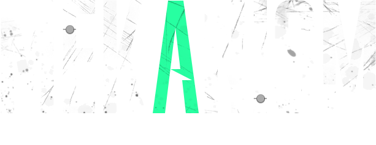
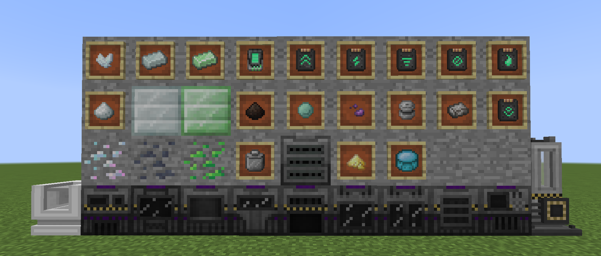

# Repository description for sddsd2332 #

Here is sddsd2332 for the Minecraft modpacks [Ultimate Technology] modified Mekanism

If you need this mod, you can fork the repository to build, or go to the actions of the repository to download the latest build

If there is a good proposal, it can be submitted through a PR

I may not have time to update, maybe this is an update for the last version

The repository is no longer in use, if you need to discuss, please go to [Mekanism-CE-Unofficial-1.12.2](https://github.com/sddsd2332/Mekanism-CE-Unofficial-1.12.2) here, MEKCEU is based on MEKCE and MEKV10

# Mekanism for Minecraft 1.12 #

Mekanism is a Minecraft add-on featuring high-tech machinery that can be used to create powerful tools,
armor, and weapons. You can find more detail on the features at the [**Official Website**](http://aidancbrady.com/mekanism/).
Mekanism is an independent tech mod that brings low, mid, and high tier machinery to Minecraft. The
mod doesn't have an actual goal, and you'll understand this when you see all the random content
Mekanism contains, from jetpacks to balloons. However, I can assure you that you'll notice all the
content blend together as you get to know the mod better!

Mekanism uses a tier-based system when organizing several of its core features, including Energy
Cubes and Factories. There are four tiers: basic, the simplest tier, advanced, the second-most basic
tier, elite, the second-most complex tier, and ultimate, the most complex tier. You can upgrade
tiers by placing the component in a crafting grid and surrounding it with the necessary resources
for the next upgrade.

By the time you've been using Mekanism for a while, you'll have a near-instructible suit of Obsidian
Armor, be obtaining four ingots for each ore you mine, have the ability to fly wherever you want with
the hydrogen-powered jetpacks, and have a cute robotic friend following you around while you mine. :)

# Discord #

Official Mekanism has a[discord](https://discord.gg/nmSjMGc) where you can come chat with other Mekanism users and the developers. Join us!

# License #

[LICENSE](https://raw.githubusercontent.com/sddsd2332/MEK-1.12.2-v10/main/LICENSE.md)

[ORIGINAL MOD](https://github.com/mekanism/Mekanism)

# Credits #

* aidancbrady
* thommy101
* thiakil
* pupnewfster
* dizzyd
* unpairedbracket
* CyanideX (artwork)
* Cheapshot (artwork)
* Archadia (artwork)
* micdoodle
* Bluexin
* JaSpr

## YourKit ##
YourKit supports open source projects with innovative and intelligent tools for monitoring and
profiling Java and .NET applications. YourKit is the creator of [YourKit Java Profiler](https://www.yourkit.com/java/profiler),
[YourKit .NET Profiler](https://www.yourkit.com/.net/profiler/) and [YourKit YouMonitor](https://www.yourkit.com/youmonitor/).
Mekanism uses YourKit for all our profiling needs!
